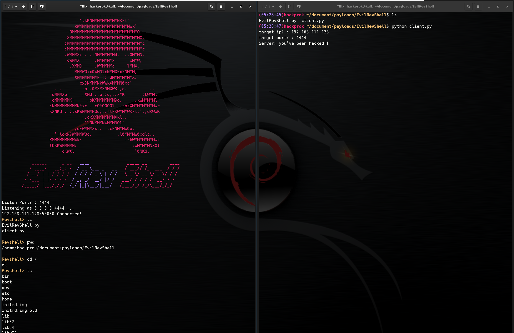

# EvilRevShell
```
      ______      _ __   ____               _____ __         ____  
     / ____/   __(_) /  / __ \___ _   __   / ___// /_  ___  / / /  
    / __/ | | / / / /  / /_/ / _ \ | / /   \__ \/ __ \/ _ \/ / /   
   / /___ | |/ / / /  / _, _/  __/ |/ /   ___/ / / / /  __/ / /    
  /_____/ |___/_/_/  /_/ |_|\___/|___/   /____/_/ /_/\___/_/_/     

```
DISCLAIMER:  
This is only for educational purpose and not made for acutual attacking. I will not take any resoponsibility caused by this tool.

<br/>

## What is this?

EvilRevShell is a simple python script that will make a reverse tcp connection. To be specific, rather than getting a real shell, this program let attacker(server) execute an command on victim's(client) current shell's subprocess via python subprocess module. EvilRevShell should both work on Windows/Mac/Linux.

<br/>

## Usage

### Attacker
Execute server program by
```
python EvilRevShell.py
```
Then, enter the listening port and wait for the client's connection

### Victim
After server is ready, execute the client program by
```
python client.py
```
if it succeeds, message "you've been hacked!!" should appear in the client machine and the shell "Revshell>" should appear on attacker's machine.

<br/>

## Notes
* I didn't check what command is abled to use in attacker's console
* server's listening host is "0.0.0.0"
